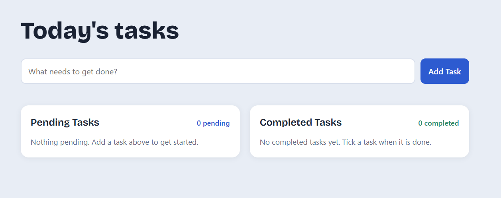

# To-Do Web App (Web Development - Level 2, Task 3)

An interactive to-do list built with vanilla HTML5, CSS3 and JavaScript. Tasks are split into
Pending and Completed lists, and they are saved in the browser so they survive a page refresh.

## How to run

Open `index.html` in a browser. No build step or server is needed.
(Google Fonts load online; the app falls back to system fonts if offline.)

## Checklist

- [x] Input field and "Add Task" button (Enter key also works)
- [x] New tasks appear immediately in the Pending Tasks list
- [x] Tick the checkbox to move a task to Completed (untick to move it back)
- [x] Edit button for inline editing (Save, Cancel, Enter to save, Esc to cancel)
- [x] Delete button removes a task permanently from either list
- [x] Counters above each list: "X pending" and "Y completed"
- [x] Bonus: timestamp for when each task was added and completed
- [x] Bonus: tasks persist across refreshes using `localStorage`
- [x] Empty state messages for both lists
- [x] Input validation: empty tasks are rejected with a message

## Notes

- Text is inserted with `textContent`, so typed HTML is never executed.
- If `localStorage` is blocked (for example in some private modes), the app still works for the current session.

## Project structure

```
WebDev-L2-TodoApp/
  index.html
  style.css
  script.js
  README.md
```

## Screenshots


