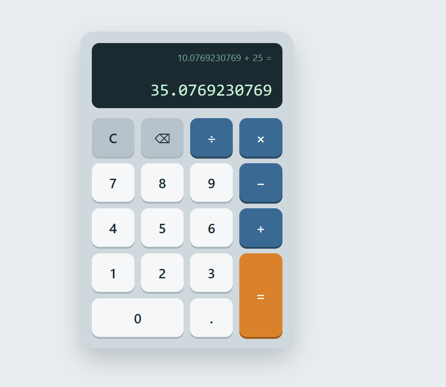

# Calculator (Web Development - Level 2, Task 1)

A browser-based calculator built with vanilla HTML5, CSS3 and JavaScript.
No libraries, no frameworks, and no `eval()`: all arithmetic is done with
variables, `switch` statements and conditionals.

## How to run

Open `index.html` in any modern browser. No build step or server is needed.

## Features

- Display screen showing the current input, the result, and the pending expression
- Number buttons (0-9) and a decimal point
- Operators: addition (+), subtraction (-), multiplication (x), division (/)
- Equals (=) button to evaluate
- Clear (C) button to reset everything
- Backspace button to remove the last entered character
- Division by zero shows "Cannot divide by 0" instead of crashing
- Operator chaining without a reset (for example 5 + 3 x 2)
- CSS Grid for the button layout
- All buttons use `addEventListener` (no inline `onclick` attributes)
- Bonus: keyboard support, light/dark theme, floating-point rounding (0.1 + 0.2 = 0.3)

## Operator chaining

Operations are evaluated left to right as each operator is pressed,
like a standard handheld calculator:

`5 + 3 x 2` -> pressing x computes `5 + 3 = 8`, then `8 x 2 = 16`.

## Keyboard shortcuts

| Key | Action |
| --- | --- |
| 0-9, `.` | Enter digits |
| `+`, `-`, `*`, `/` | Operators |
| `Enter` or `=` | Equals |
| `Backspace` | Delete last character |
| `Esc` or `C` | Clear |

## Project structure

```
WebDev-L2-Calculator/
  index.html   page structure
  style.css    styling (CSS Grid layout, light/dark theme)
  script.js    calculator logic and event listeners
  README.md    this file
```

## Tech stack

HTML5, CSS3 (Grid), JavaScript (vanilla)

## Screenshots

Add your screenshots to a `screenshots/` folder in this directory.

